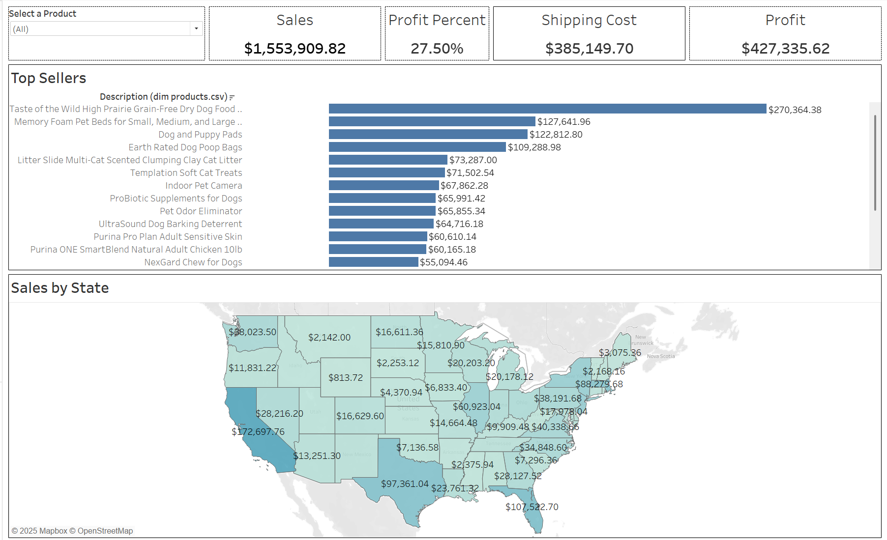
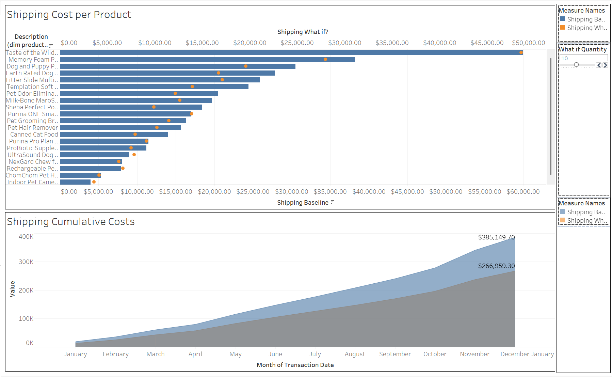

# 📊 ECommerce Performance and Shipping Cost Analytics Dashboard

This project features two interactive Tableau dashboards that provide in-depth analysis and visualization of eCommerce sales performance and predictive shipping costs. Designed to support data-driven decision-making across product strategy, regional marketing, and logistics planning.

## 🚀 Project Overview

This Tableau-based analytics project focuses on two main areas:

1. **Sales and Profit Dashboard**  
   - Visualizes total sales, profit, shipping cost, and profit margin.  
   - Identifies top-selling SKUs and visualizes state-wise sales distribution across the U.S.  
   - Enables dynamic filtering of metrics by product.

2. **Shipping Cost Prediction Dashboard**  
   - Models the relationship between order quantity and shipping cost per SKU.  
   - Utilizes horizontal bar charts and area graphs to forecast logistics expenses.  
   - Aims to support cost-optimization in shipping and fulfillment strategies.

## 📈 Key Features

- ✅ Clean, user-friendly interface with dropdown filters.  
- 📍 Geographic sales heatmap with state-level granularity.  
- 📦 SKU-level performance ranking and margin insights.  
- 📊 Predictive visualization for shipping costs based on order volumes.  
- ⚙️ Built entirely in Tableau using calculated fields, filters, parameters, and maps.

## 🛠 Tools & Technologies

- **Tableau Desktop** – Data visualization and dashboard creation  
- **Excel/CSV** – Source data inputs  
- **Calculated Fields & Filters** – Data transformation  
- **Bar Charts, Area Graphs, Maps** – Visual components

## 📌 Project Goals

Enable eCommerce stakeholders to make informed decisions on:
- Inventory management  
- Product prioritization  
- Regional targeting  
- Logistics planning

## 🖼 Dashboard Previews

| Sales Dashboard | Shipping Cost Prediction |
|-----------------|--------------------------|
|  |  |

> Replace the image paths with actual ones once you upload your dashboard screenshots to the `assets/` folder in your repo.

## 📁 File Structure

📦 Ecommerce-Analytics-Dashboard
┣ 📂 assets/
┃ ┣ 📸 sales_dashboard.png
┃ ┗ 📸 shipping_dashboard.png
┣ 📂 data/
┃ ┗ 📄 ecommerce_data.csv
┣ 📄 Ecommerce_Analysis.twb
┣ 📄 README.md

## 🙌 Acknowledgments

This project was developed as part of a data visualization initiative to derive actionable insights from retail data. Special thanks to the instructors and peers who provided valuable feedback.
